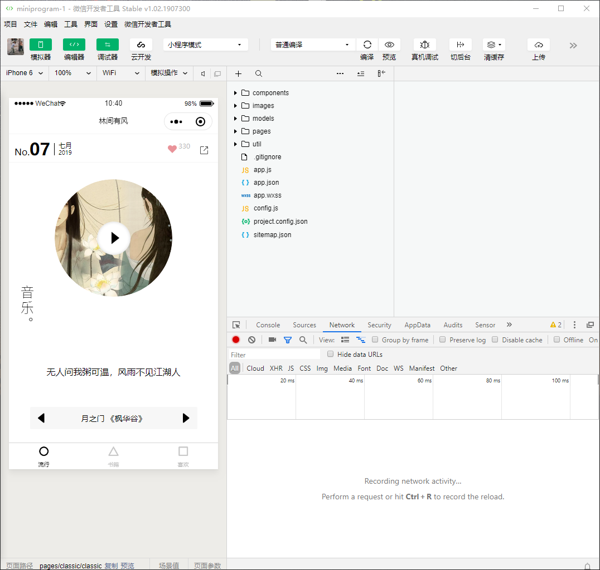
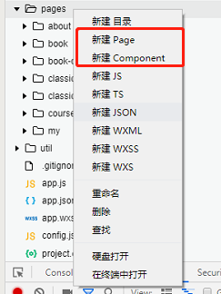
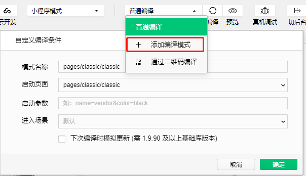
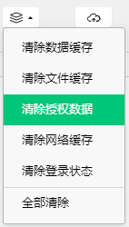
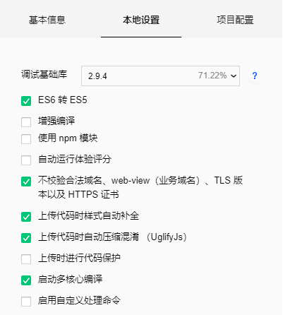

# 准备工作

## 前言
在小程序开发中，个人认为最重要的是看**官方文档**！因为小程序的主要开发语言是 JavaScript，所以小程序的开发同普通的网页开发相比有很大的相似性。对于前端开发者而言，学习小程序开发的成本并不高，但是二者还是有些区别。

## 准备工作
* 申请开发者账号   

1. 首先进入 [小程序注册页](https://mp.weixin.qq.com/wxopen/waregister?action=step1)  根据指引填写对应的信息，并且在这个小程序管理平台，你可以管理自己小程序的权限，查看数据报表等信息。

2. 登录后台之后，就可以查看到小程序的 **AppID**。小程序的 **AppID** 相当于小程序平台的一个身份证，后续会在很多地方用到。

* 安装开发者工具   

这个其实没啥好说的，点击 [这里](https://developers.weixin.qq.com/miniprogram/dev/devtools/download.html) 根据自己的系统安装就完事了。

* 第一个小程序项目   

下面是个人根据 **imooc** 上 **七月** 的课程开发的小程序项目，而平时新建项目的时候需要选择代码存放的硬盘路径，填入刚刚申请到的 AppID。

## 微信开发者工具注意事项

* 编辑器   

小程序编写代码是可以用自己习惯的编辑器来编写的，但是如果使用微信管理工具中自带的编辑器有个比较好的地方就是在下图红框处新建 **页面** 或者 **组件**。它可以一次性帮你新建四个必需的文件： wxml, wxss,js, json

* 编译模式   

分为**普通编译**和**自定义编译模式**，普通编译就是默认按照你在app.json中配置的页面顺序开始编译，自定义呢就是可以指定页面路径开始编译，并且可以自定义进入这个路径时的参数 例如 id = 1

* 清理缓存   

里面有多种缓存清除选择，假如我们使用了 **localStorage** 或者 **小程序登录授权**等功能，微信管理工具会缓存我们这些数据，在测试的时候要注意这点。

* 详情配置   

可能大多数前端开发者都会习惯使用ES6的语法，所以要在详情里面勾选对应的配置。并且后台的接口在测试的时候可以用http，但是在上线（甚至上传体验版）接口都要改成https，否则小程序是加载不到数据的。

