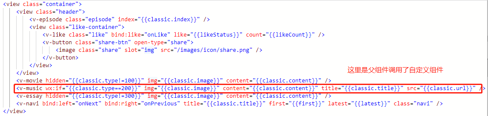
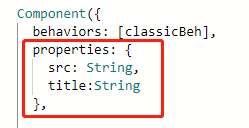
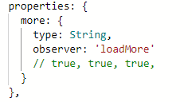

# 组件开发

## 自定义组件

在小程序开发中，开发者可以将页面内的功能模块抽象成自定义组件（个人习惯一般区分通用组件和业务组件），以便在不同的页面中重复使用。一些组件相关的功能上一篇文章也有提到，这里再提一下重要的几个点。

## properties 和 data

在小程序的组件中，通常会有两个属性，**properties** 和 **data**。前者是组件对外的属性，可以用于父组件向子组件传值。后者是组件的内部数据，和properties 一同用于组件的模板渲染。我们可以参考下面这张图片，父组件 classic 调用了自定义组件 v-music，并且传递了2个 v-music 组件中定义的两个properties属性：content，title。

可以留意到在properties中我们给数据赋予的是一个类型值，这是官方文档规定的。正常的properties后面会接一个对象例如下图

    
里面比较关键的是 **observer** 这个监听函数，它可以监听到这个值发生变化的时候触发某个函数。**应用场景：下拉刷新加载更多数据**。

**假如我们在页面中输出 this.properties 和 this.data 会发现两者都会指向同一个对象，换一种说法我们可以理解为小程序会把 properties对象 和 data对象合并成一个对象。但是假如两者之间的变量名有重复，properties 会覆盖 data中的变量**

## 组件间的通信与事件

组件的通信上面已经提到过利用 **properties** 父组件向子组件传递值的方法。还有一种子组件向父组件触发自定义事件的方法： **this.triggerEvent 指定事件名，detail对象和事件选项**。

那么父组件就可以通过 bind:myevent = “xxx”来接收来自子组件的事件。

如果以上两种方式都无法满足需要，可以现在引用子组件的时候绑定一个id，父组件就可以通过这个id值利用 this.selectComponent 方法获取子组件实例对象，这样就可以直接访问组件的任意数据和方法。