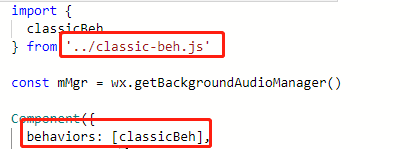

# 简单介绍

## 文件介绍

* **WXML**   

作为前端开发者应该都知道，网页编程采用的是 HTML+CSS+JS 这样的组合，同理，在小程序中 **WXML** 就是充当 HTML 的角色

WXML 和 HTML 非常类似，同样也由标签、属性等构成。但是也有很多不一样的地方：

1. 标签名不同   

通常写 HTML 的时候常用的标签是 div，span 等，开发者在写一个页面的时候可以根据这个基础标签组合成不同的组件。而小程序就封装了自己的标签 view， button， text等。

2. 与vue类似的操作方式   

用过小程序可能会发现它和 vue 非常相似，它同样具备 **{{ }}** 这样的插值表达式以及 **wx:if , wx: show** 等功能。**但是这里要提一个比较关键的地方，在 vue 中我们可以使用 v-model做到双向绑定，但是在小程序中只要你在WXML中绑定了一个变量，接着你在JS中有所修改的话必须通过 **this.setData({ xx:xxx })**  这个小程序内置的API去做一个状态的更新**。

* **WXSS**   

这个没啥好说的，WXSS具有大部分 CSS 的特性，小程序在 WXSS中新增了尺寸单位 **rpx**，这个 **rpx** 是可以根据手机设备的屏幕去自适应的，但是要清楚不是所有的地方都是用 rpx ，该写死的地方还是得写死。

* **JS**      

一个服务仅仅只有界面展示是不够的，小程序中的交互事件和vue类似，通过**bind:tap = ""** 来绑定一个点击事件，并且在page当中声明一个 methods 来在里面定义。

* **JSON**   

JSON配置是一种数据格式，并不是编程语言，在小程序中，JSON扮演的静态配置的角色。JSON文件中是无法使用注释的，试图添加注释将会引发报错。

通常由微信开发者工具帮我们建立好一个基础模板后，页面会有 **app.json** 这个文件，里面是当前小程序的全局配置，包括了**页面路径，界面表现，底部tab**等。点[这里](https://developers.weixin.qq.com/miniprogram/dev/framework/config.html)看具体配置        

每一个页面和组件也都会有对应的 **page.json** 文件，这里的配置是表明和页面相关的配置，并且在页面中引用相关组件也需在JSON中配置。点[这里](https://developers.weixin.qq.com/miniprogram/dev/framework/config.html#全局配置)看具体配置。        

下图是全局JSON的一些配置信息。

## 生命周期    

小程序和vue一样有自己的生命周期函数，可以在特定的时候指定事件触发。而小程序的生命周期分两种：

### 页面生命周期

onLoad( )页面创建时执行, onShow( )页面出现在前台时执行,onReady( )页面首次渲染完毕时执行,onUnload( )页面销毁时执行这里是常用的几个，具体详细的可以看[这里](https://developers.weixin.qq.com/miniprogram/dev/framework/app-service/page-life-cycle.html)   

### 组件生命周期

组件的生命周期，指的是组件自身的一些函数。其中最重要的是 **created attached detached**

* 组件实例刚刚被创建的时候，**created** 被触发。但是在组件当中的 **data** 是不能够进行**setData**。通常情况下，这个生命周期只能给组件 this 添加一些自定义属性字段。

* 在组件完全初始化完毕，进入页面节点树后，**attached** 生命周期被触发。此时，**this.data** 已经被初始化为组件的当前值。绝大数初始化工作可以在这个时机进行。

* 在组件离开页面节点树后，**detached** 生命周期被触发。退出一个页面，如果组件还在页面节点树，则 **detached** 被触发。

## 模块化    

作为前端开发人员来讲模块化算是一个比较重要的概念。它可以将一些公共的代码抽离成为一个单独的JS文件，作为一个模块。模块通过 module.exports 或者 exports 才能对外暴露接口。以下是在小程序中使用模块化的几个心得。

* behaviors   

这个behaviors 可以理解为 vue 的mixin，它用于组件间代码共享的特性，每个 behavior 可以包含一组属性、数据、生命周期函数和方法。组件引用它时，它的属性、数据等会被合并到组件中（若有重复变量，则组件内部优先级较高）。每个组件可以引用多个 behavior, behavior 也可以引用其它 behavior。值得一提的是 from 的时候需要绝对路径。并且在使用时 需要进行和第二个红框一样的引用

        
* WXS   

WXS是小程序的一套脚本语言，结合 WXML，可以构建出页面的结构，它的语法和ES5差不多，总的来说就是可以在WXML中编写WXS代码提高便利性。通常我们在使用WXS的时候也会习惯性把它封装成一个文件，需要的时候进行引用，当然也可以在页面中编写。具体语法看[这里](https://developers.weixin.qq.com/miniprogram/dev/reference/wxs/01wxs-module.html)。

* 封装http请求   

这个严格来讲和小程序相关性不大。因为平时做前端项目也是需要自行封装ajax或者基于 axios 进一步封装。但是对于小程序的编程规范来讲最好封装一个http请求（用promise 或者 async await），然后把请求的接口或者其它业务逻辑封装在一个models文件夹中，从而可以减少页面代码量。

            
