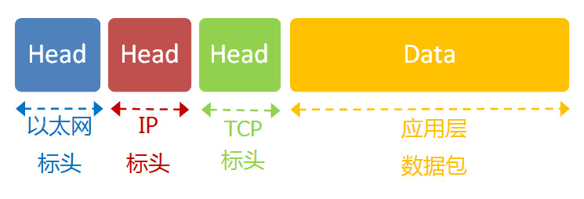

# OSI七层模型

看到阮一峰老师这篇文章写的挺详细的，于是摘抄下来做个记录。

OSI的七层体系结构概念清楚，理论也很完整，但是它**比较复杂而且不实用**。简单提一下之前一直被一些大公司甚至一些国家政府支持的OSI失败的原因：
        
1. OSI的协议实现起来过分复杂，而且运行效率很低

2. OSI的层次划分不太合理，有些功能在多个层次中重复出现

## 五层协议的体系结构

学习计算机网络时我们一般使用折中的办法，也就是中和 OSI 和TCP/IP 的优点，采用一种只有五层协议的体系结构，这样既简洁又能够将概念阐述清楚 

每一层都是为了完成一种功能。为了实现这些功能，就需要大家都遵守共同的规则——‘协议’

互联网的每一层都定义了很多协议，这些协议的总称就叫做 **‘互联网协议’**

接下来从下至上简单分析下五层结构 **物理层 -> 数据链路层 -> 网络层 -> 传输层 -> 应用层**

### 物理层（实体层）

电脑要连网，第一件事要干啥？当然是先把电脑通过 光缆、电缆、双绞线、光纤、无线电波 等方式连起来。这就叫做‘物理层’，它就是把电脑连接起来的物理手段。它主要规定了网络的一些电气特性，作用是负责传送 0 和 1的电信号。

### 数据链路层（链接层）

单纯的 0 和 1 是没有任何意义的，必须规定解读方式：多少个电信号算一组？每个信号位有何意义？

这就是链路层的作用，它再‘物理层’的上方，确定了 0 和 1的分组方式

#### 以太网协议

早期的时候，每家公司都有自己的电信号分组方式。逐渐地，一种叫做‘以太网’协议，占据了主导地位。以太网规定，一组电信号组成一个数据包，叫做‘帧’。每一帧分成两个部分，标头 和 数据。

‘标头’包含数据包的一些说明项，比如发送者、接收者、数据类型等；‘数据’则是数据包的具体内容。

‘标头’的长度，固定为18字节。‘数据’的长度最短为46字节，最长为1500字节。因此，整个‘帧’最短为64字节，最长为1518字节。

#### MAC地址

上面提到，以太网数据包的‘标头’，包含了发送者和接收者的信息。那么，发送者和接收者是如何标识的呢？

以太网规定，连入网络的所有设备，都必须具有‘网卡’接口。数据包必须是从一块网卡，传送到另一块网卡。网卡的地址，就是数据包的发送地址和接收地址，这就叫做MAC地址

每块网卡出厂的时候，都有一个全世界独一无二的MAC地址，长度是48个二进制位，通常用12个十六进制数表示。有了MAC地址，就可以定位网卡和数据包的路径了

#### 广播

定义完地址后，后面还有更多的步骤
        
首先，一块网卡怎么会知道另一块网卡的MAC地址呢？

回答是ARP协议，可以解决这个问题。以太网数据包必须知道接收方的MAC地址后才能发送

其次，就算有了MAC地址，系统怎样才能准确的发送到接收方呢？

回答是以太网采用了一种很‘原始’的方式，它不是把数据包准确送到接收方，而是**向本网络内所有计算机发送，让每台计算机自己判断是否为接收方**

图中1号计算机向2号计算机发送一个数据包，同一个子网络的3号、4号、5号计算机都会收到这个包。它们通过读取这个包的标头来获取接收方的MAC地址，然后与自身的MAC地址比较，如果相同就选择接收这个包做进一步处理，否则就丢弃这个包。这种发送方式就叫做 ‘广播’

### 网络层

以太网协议，依靠MAC地址发送数据。理论上，单单靠MAC地址，上海的网卡就可以找到洛杉矶的网卡，技术上是可以实现，但是！！！！！！！！这样做有一个重要的缺点，以太网采用广播的方式发送数据包，所有成员人手一 ‘包’，不仅效率低，而且局限在发送者所在的子网络。也就是说，如果两台计算机不在同一个自网络，广播是传不过去的。

互联网是无数子网络共同组成的一个巨型网络，很难想象上海和洛杉矶的电脑会在同一个子网络，这几乎是不可能。

因此，必须找到一种方法， 能够区分那些MAC地址属于同一个子网络，哪些不是。如果处在同一个子网络，就采用广播方式，否则就采用‘路由’方式发送

这就导致了‘网络层’的诞生。它的作用就是引进一套新的地址，使得我们能够区分不同的计算是否属于同一个子网络。这套地址就i叫做‘网络地址’，简称‘网址’

### IP协议

规定网络地址的协议，叫做IP协议。它所定义的地址，就被称为IP地址

目前广泛采用的是IP协议的第四版，简称IPV4。这个版本规定，网络地址由32个二进制组成

习惯上，我们采用分成四段的十进制数表示IP地址，从 0.0.0.0 一直到 255.255.255.255

互联网上的每一台计算机，都会被分配到一个IP地址。这个地址分成两个部分，前一部分代表网络，后一部分代表主机。比如，IP地址 172.16.254.1 这是一个32位的地址，假设它的网络部分是前24位（172.16.254），那么主机部位就是后8位（1）。处于同一个子网络的电脑，它们的IP地址的网络部分必定是相同的，也就是说172.16.254.2 和 172.16.254.1 处在同一个子网络

那么，怎样通过IP地址判断计算是否属于同一个子网络呢？这就要用到另一个参数‘子网掩码’

所谓子网掩码，就是表示子网络特征的一个参数。它在形式上等同于IP地址，也就是一个32位二进制的数字，它的网络部分全是1，主机部分全是0。比如，IP地址 172.16.254.1 ，如果已知网络部分是前24位，那么它的子网掩码就是 255.255.255.0

知道了子网掩码，我们就能判断任意两个IP地址是否处在同一个子网络。方法是分别将两个IP地址与子网掩码进行 AND 运算，然后比较结果是否相同

总结一下，**IP协议的作用主要有两个，一个是为每一台计算机分配IP地址，另一个是确定哪些地址在同一个子网络**

#### IP数据包

根据IP协议发送的数据，就叫做IP数据包。不难想象，其中必定包括IP地址信息。

但是前面说过，以太网数据包只包含MAC地址，并没有IP地址的栏位。那么是否需要修改数据定义，再添加一个栏位呢？

回答是不需要，我们可以把IP数据包直接放进以太网数据包的"数据"部分，因此完全不用修改以太网的规格。这就是互联网分层结构的好处：上层的变动完全不涉及下层的结构。

具体来说，IP数据包也分为**标头**和**数据**两个部分。

"标头"部分主要包括版本、长度、IP地址等信息，"数据"部分则是IP数据包的具体内容。它放进以太网数据包后，以太网数据包就变成了下面这样。

IP数据包的"标头"部分的长度为20到60字节，整个数据包的总长度最大为65,535字节。因此，理论上，一个IP数据包的"数据"部分，最长为65,515字节。前面说过，以太网数据包的"数据"部分，最长只有1500字节。因此，如果IP数据包超过了1500字节，它就需要分割成几个以太网数据包，分开发送了。

**ARP协议：**

关于"网络层"，还有最后一点需要说明。

因为IP数据包是放在以太网数据包里发送的，所以我们必须同时知道两个地址，一个是对方的MAC地址，另一个是对方的IP地址。通常情况下，对方的IP地址是已知的（后文会解释），但是我们不知道它的MAC地址。

所以，我们需要一种机制，能够从IP地址得到MAC地址。

这里又可以分成两种情况。第一种情况，如果两台主机不在同一个子网络，那么事实上没有办法得到对方的MAC地址，只能把数据包传送到两个子网络连接处的"网关"（gateway），让网关去处理。

第二种情况，如果两台主机在同一个子网络，那么我们可以用ARP协议，得到对方的MAC地址。ARP协议也是发出一个数据包（包含在以太网数据包中），其中包含它所要查询主机的IP地址，在对方的MAC地址这一栏，填的是FF:FF:FF:FF:FF:FF，表示这是一个"广播"地址。它所在子网络的每一台主机，都会收到这个数据包，从中取出IP地址，与自身的IP地址进行比较。如果两者相同，都做出回复，向对方报告自己的MAC地址，否则就丢弃这个包。

总之，有了ARP协议之后，我们就可以得到同一个子网络内的主机MAC地址，可以把数据包发送到任意一台主机之上了。

### 传输层

有了MAC地址和IP地址，我们已经可以在互联网上任意两台主机上建立通信。

接下来的问题是，同一台主机上有许多程序都需要用到网络，比如，你一边浏览网页，一边与朋友在线聊天。当一个数据包从互联网上发来的时候，你怎么知道，它是表示网页的内容，还是表示在线聊天的内容？

也就是说，我们还需要一个参数，表示这个数据包到底供哪个程序（进程）使用。这个参数就叫做"端口"（port），它其实是每一个使用网卡的程序的编号。每个数据包都发到主机的特定端口，所以不同的程序就能取到自己所需要的数据。

"端口"是0到65535之间的一个整数，正好16个二进制位。0到1023的端口被系统占用，用户只能选用大于1023的端口。不管是浏览网页还是在线聊天，应用程序会随机选用一个端口，然后与服务器的相应端口联系。

"传输层"的功能，就是建立"端口到端口"的通信。相比之下，"网络层"的功能是建立"主机到主机"的通信。只要确定主机和端口，我们就能实现程序之间的交流。因此，Unix系统就把主机+端口，叫做"套接字"（socket）。有了它，就可以进行网络应用程序开发了。

#### UDP协议

现在，我们必须在数据包中加入端口信息，这就需要新的协议。最简单的实现叫做UDP协议，它的格式几乎就是在数据前面，加上端口号。

UDP数据包，也是由"标头"和"数据"两部分组成。

"标头"部分主要定义了发出端口和接收端口，"数据"部分就是具体的内容。然后，把整个UDP数据包放入IP数据包的"数据"部分，而前面说过，IP数据包又是放在以太网数据包之中的，所以整个以太网数据包现在变成了下面这样：

UDP数据包非常简单，"标头"部分一共只有8个字节，总长度不超过65,535字节，正好放进一个IP数据包。

#### TCP协议

UDP协议的优点是比较简单，容易实现，但是缺点是可靠性较差，一旦数据包发出，无法知道对方是否收到。
    
为了解决这个问题，提高网络可靠性，TCP协议就诞生了。这个协议非常复杂，但可以近似认为，它就是有确认机制的UDP协议，每发出一个数据包都要求确认。如果有一个数据包遗失，就收不到确认，发出方就知道有必要重发这个数据包了。

因此，TCP协议能够确保数据不会遗失。它的缺点是过程复杂、实现困难、消耗较多的资源。

TCP数据包和UDP数据包一样，都是内嵌在IP数据包的"数据"部分。TCP数据包没有长度限制，理论上可以无限长，但是为了保证网络的效率，通常TCP数据包的长度不会超过IP数据包的长度，以确保单个TCP数据包不必再分割。

### 应用层

应用程序收到"传输层"的数据，接下来就要进行解读。由于互联网是开放架构，数据来源五花八门，必须事先规定好格式，否则根本无法解读。

"应用层"的作用，就是规定应用程序的数据格式。

举例来说，TCP协议可以为各种各样的程序传递数据，比如Email、WWW、FTP等等。那么，必须有不同协议规定电子邮件、网页、FTP数据的格式，这些应用程序协议就构成了"应用层"。

这是最高的一层，直接面对用户。它的数据就放在TCP数据包的"数据"部分。因此，现在的以太网的数据包就变成下面这样。

**至此，整个互联网的五层结构，自下而上全部讲完了。这是从系统的角度，解释互联网是如何构成的。**