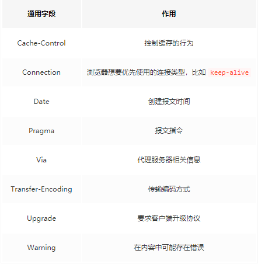
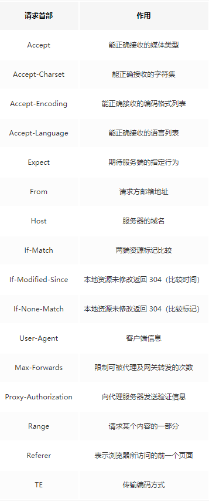
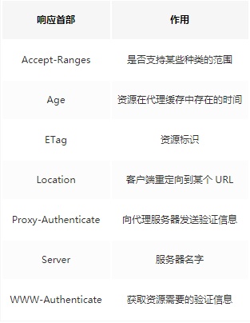
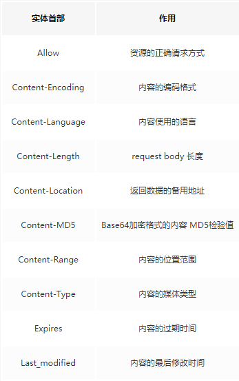
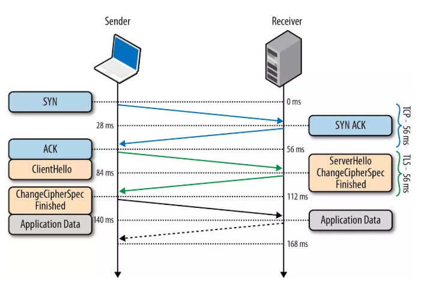

# HTTP 和 TLS  

## HTTP基本概念    
HTTP的全称是 **超文本传输协议**，也是现今在 **WWW** 上应用最多的协议，**HTTP**是应用层协议，当你上网浏览网页的时候，浏览器和web服务器就会通过**HTTP** 在 **Internet** 上进行数据的发送和接受。HTTP是一个基于**请求/相应模式的、无状态的协议**。

### 特点
* 无连接：无连接的含义是限制每次链接只处理一个请求。服务器处理完客户的请求，并收到客户的应答后，即断开链接，采用这种方式可以节省传输时间。

* 无状态： HTTP协议是无状态协议。无状态是指协议对于事物处理没有记忆能力。缺少状态意味着如果后续处理需要前面的信息，则它必须重传，这样会导致每次连接传送的数据量增大。另一方面，在无服务不需要先前信息时它的应答就比较快。

* 灵活：HTTP允许传输任意类型的数据对象。正在传输的类型有 Content-Type加以标记。

* 简单快速：客户端向服务器请求服务时，只需传送请求方法和路径。由于HTTP协议简单，使得HTTP服务器的程序规模比较小，因而通信速度很快。

### HTTP的请求三部分
* 请求行

* 首部

* 实体

请求行大概长这样 
```js
GET/images/logo.gif HTTP/1.1  
```
基本由 **请求方法、URL、协议版本**组成，其中值得一提的就是请求方法了。        

#### 请求方法有很八种：        
**GET 、POST 、 PUT 、 DELETE 、 OPTIONS 、 HEAD、 TRACE、 CONNECT**        
但是最常用的也就是GET 和 POST了。虽然请求方法有很多，但是更多的方法只是传递一个**语义**，只是为了语义化提交方式，而不是说POST能做的事情，GET就不能做了。如果你喜欢，都是用GET请求或者POST请求也是可以的。    
#### 从技术层面讲一下GET 和 POST两者的区别：
* Get能缓存，POST不能

* POST相对GET会安全一点点，因为Get请求都包含在URL里面（当然你写在body里面也是可以的），且会被浏览器保存历史纪录。Post不会，但是在抓包的情况下两者都是一样的。

* URL有长度限制，会影响Get请求，但是这个长度限制是浏览器规定的，不是RFC规定的。

* Post支持更多的编码类型且不对数据类型限制。

#### 首部
分为请求首部和响应首部，并且部分首部两种通用，接下来我们就来学习一部分的常用首部。

* 通用首部   
 

* 请求首部   
   

* 响应首部   
  

* 实体首部   
 

#### 常见状态码        
状态码表示了响应的一个状态，可以让我们清晰的了解到这一次请求还是成功还是失败，假如是失败，也可以知道是什么原因导致的，当然状态码也是用于传达语义的。如果胡乱使用，那么它存在的意义就没有了。         

**2XX 成功**   

* 200 OK，表示从客户端发来的请求在服务器端被正确处理
* 204 No content，表示请求成功，但响应报文不含实体的主体部分
* 205 Reset Content，表示请求成功，但响应报文不含实体的主体部分，但是与 204 响应不同在于要求请求方重置内容
* 206 Partial Content，进行范围请求

**3XX 重定向**   

* 301 moved permanently，永久性重定向，表示资源已被分配了新的 URL
* 302 found，临时性重定向，表示资源临时被分配了新的 URL
* 303 see other，表示资源存在着另一个 URL，应使用 GET 方法获取资源
* 304 not modified，表示服务器允许访问资源，但因发生请求未满足条件的情况
* 307 temporary redirect，临时重定向，和302含义类似，但是期望客户端保持请求方法不变向新的地址发出请求

**4XX 客户端错误**   

* 400 bad request，请求报文存在语法错误
* 401 unauthorized，表示发送的请求需要有通过 HTTP 认证的认证信息
* 403 forbidden，表示对请求资源的访问被服务器拒绝
* 404 not found，表示在服务器上没有找到请求的资源

**5XX 服务器错误**   

* 500 internal sever error，表示服务器端在执行请求时发生了错误
* 501 Not Implemented，表示服务器不支持当前请求所需要的某个功能
* 503 service unavailable，表明服务器暂时处于超负载或正在停机维护，无法处理请求


## TLS
HTTPS 还是通过 **HTTP** 来传输信息，但是信息通过了 **TLS** 协议进行了加密。

TLS 协议位于传输层之上，应用层之下。首个进行 TLS协议 传输需要两个RTT，接下来可以通过 Session Resumption 减少到一个RTT。

在TLS 中使用了两种加密技术，分别为 **对称加密**和 **非对称加密**。

### 对称加密：

对称加密就是两边拥有相同的密钥，两边都知道如何将密文加密解密。

这种加密方式固然很好，但是问题在于如何让双方知道密钥。因为传输数据都是走的网络，如果将密钥通过网络的方式传递的话，一旦密钥被捕获就没有加密的意义了。

### 非对称加密：

有公钥私钥之分，公钥所有人都可以知道，可以将数据用公钥加密，但是将数据解密必须使用私钥，私钥只有分发公钥的一方才知道。
            
这种加密方式就可以完美解决对称加密存在的问题。假设现在两端需要使用对称加密，那么在此之前，可以先使用非对称加密交换密钥。

### 简单流程如下：

首先服务端将公钥公布出去了，那么客户端也知道了公钥。接下来客户端创建一个密钥，然后通过公钥加密并发送给服务端，服务端接收到密文以后通过私钥解密出正确的密钥，这时候两端就都知道密钥是什么了。

TLS 握手过程如下图：
                      

1. 客户端发送一个随机值以及需要的协议和加密方式。

2. 服务端收到客户端的随机值，自己也产生一个随机值，并根据客户端需求的协议和加密方式来使用对应的方式，并且发送自己的证书（如果需要验证客户端证书需要说明）
                
3. 客户端收到服务端的证书并验证是否有效，验证通过会再生成一个随机值，通过服务端证书的公钥加密这个随机值并发送给服务端，如果服务端需要验证客户端证书的话会附带证书。

4. 服务端收到加密过的随机值并使用私钥解密获得第三个随机值，这时候两端都拥有了三个随机值，可以通过这三个随机值按照之前约定的加密方式生成密钥，接下来的通信就可以通过该密钥来加密解密。

5. 通过以上步骤可知，在TLS握手阶段，两端使用非对称加密的方式来通信，但是因为非对称加密损耗的性能比对称加密大，所以在正式传输数据时，两端使用对称加密的方式通信。