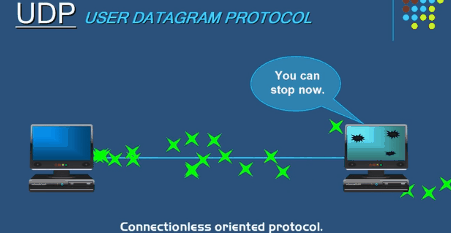
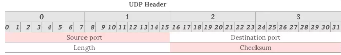
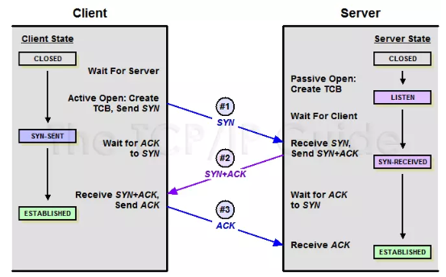
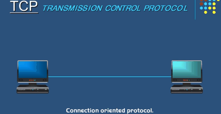
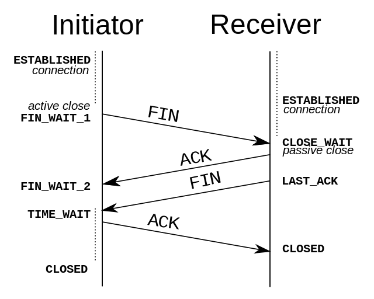

# UDP和TCP   

## 简介    
网络协议是每个前端工程师都要掌握的知识，那么接下来我们就先了解一下 **UDP** 以及 **TCP** 。

## UDP    
UDP的全称是**用户数据报协议**，在网络中它与TCP协议一样用于处理数据包，是一种 无连接 的协议。在OSI模型中，它位于第四层——传输层，处于IP协议的上一层。UDP 有不提供数据包分组、组装和不能对数据包进行排序的缺点，也就是说，当报文发送后，是无法得知其是否安全完整的送达。

### UDP的特点：

* 面向无连接   

相信很多小伙伴了解TCP的话就会知道TCP其实是有 **三次握手** 建立连接的这样一个过程，但是UDP不一样，它比较任性（熊孩子），想发数据就发数据，并且也只是**数据报文的搬运工**，不会对报文进行任何的拆分以及拼接操作。具体来说就是：

1. 在发送端，应用层将数据传递给传输层的UDP协议，UDP协议只会给数据增加 一个UDP头 标识下是UDP协议，然后就传递给网络层了

2. 在接收端，网络层将数据传递给传输层，UDP只 去除IP报文头 就传递给了应用层，不会进行任何的拼接操作。        

3. 有单播、多播、广播的功能

**UDP不止支持一对一的传输方式，同样支持一对多，多对多，多对一的方式，也就是说 UDP 提供了单播、多播、广播的功能**

* UDP是面向报文的

发送方的UDP对应用程序交下来的报文，在添加首部后就继续向下交付IP层。UDP对应用层交下来的报文，既不合并，也不拆分，而是保留这些报文的边界。因此应用程序必须选择合适大小的报文。

* 不可靠性

首先不可靠性就体现在了 无连接 上面，通信都不需要建立连接，想发就发，这样的情况肯定不牢靠（你们敢相信熊孩子吗？）。并且收到了什么数据就传递什么数据，也不会给数据备份，发送数据也不会关心对方是否已经接受到了数据（不负责任！）。再者网络环境时好时坏，但是 UDP 因为没有**拥塞控制**，一直以恒定的速度发送数据。即使网络条件不好，也不会对发送速率进行调整。这样实现的弊端就是在网络环境不好的情况下可能会导致丢包，但是优点也还是有的，在某些实时性要求比较高的场景上（例如电话会议）就需要UDP而不是TCP了

* 头部开销小，传输数据报文很高效

都说了无连接，并且不可靠，那么从侧面讲，UDP传递报文就变得十分高校，因为它不像TCP一样，要保证数据不丢失且有序到达。因此，UDP的头部开销小，只有**八字节** ，相比TCP的至少**二十字节**已经要少很多了。

UDP头部包含了以下数据：

1. 两个十六位的端口号，分别为源端口（可选字段）和目标端口

2. 整个数据报文的长度

3. 整个数据报文的检验和（IPV4 可选字段），该字段用于发现头部信息和数据中的错误         

## TCP    
当一台计算机想要与另外一台计算机进行通信的时候，两台计算机之间的通信需要畅通且可靠，这样才能保证正确收发数据。例如，当你像查看网页或者电子邮件的时候，你希望获得的是完整的文件，而不仅仅是文件的一部分，于是，我们就找到了乖孩子（TCP）。TCP协议全称是**传输控制协议**，是一种**面向连接、可靠的、基于字节流的传输层通信协议**，由 IETF 的RFC 793定义。流就是指不间断的数据结构，你可以把它想象成排水管的水流。             

### TCP的连接过程        
首先，我们需要建立连接，这是一个三次握手的过程。

假设主动发起请求的一段称为客户端，被动连接的一段称为服务端。不管是客户端还是服务端，TCP连接建立完后都能发送和接收数据，所以TCP是一个**全双工的协议**。  

起初，两端都是 CLOSED 状态。在通信开始前，双方都会创建TCB。服务器创建完TCB后便进入了LISTEN状态，此时开始等待客户端发送数据。  

* 第一次握手 

客户端向服务端发送连接请求报文段。该报文段中包含自身的数据通讯初始序号。请求发送后，客户端便进入 SYN-SENT 状态。 

* 第二次握手  

服务端收到连接请求报文段，如果同意连接，则会发送一个应答，该应答中也会包含自身的数据通讯初始序号，发送完成便进入 STN-RECEIVED 状态。   

* 第三次握手  

当客户端收到连接的同意应答后，还要向服务端发送一个确认报文。客户端发送完这个报文段后便进入了 ESTABLSHED状态，服务端收到这个应答后也进入了 ESTABLISHED 状态，此时连接建立成功。

那么在三次连接建立完成后，我们想要释放，这时候就涉及到了一个**四次挥手**的过程。 

TCP是全双工的，在断开连接时两端都要发送 **FIN** 和 **ACK**

* 第一次挥手   

若客户端A认为数据发送完成，那么它就会像服务端B发送连接释放请求  

* 第二次挥手   

B收到连接释放请求后，会告诉应用层要释放TCP链接。然后会发送ACK包，并进入CLOSE_WAIT状态，此时表明A 到 B的连接已经释放，不再接受A 发的数据了。但是因为TCP连接是双向的，所以B仍旧可以发送数据给A。    

* 第三次挥手   

B如果此时还有没发完的数据会继续发送，完毕后会向A 发送连接释放请求，然后B进入 LAST_ACK状态。 

* 第四次挥手 

A收到释放请求后，向B发送确认应答。此时A进入TIME_WAIT状态。该状态会持续 2MSL（最大段生存期，指报文段在网络中生存的时间，超时就会被抛弃）时间，若该时间段内没有B的重发的请求的话，便进入CLOSED状态。当B收到应答后，也会进入CLOSED状态。        

### TCP的特点：

* 面向连接   

指发送数据之前必须在两端建立连接。

* 仅支持单播传输   

每条TCP传输连接只能有两个端点，只能进行点对点的数据传输，不支持多播和广播的传输方式。

* 面向字节流   

TCP不像UDP一样一个个报文独立传输，而是在不保留报文边界的情况下以字节流方式进行传输。

* 可靠传输   

对于可靠传输，判断丢包，误码靠的是 TCP 的段编号以及确认好。TCP为了保证报文传输的可靠，就给每个包一个序号，同时序号也保证了传送到接收端实体的包的按序就收。然后接收端尸体对已成功收到的字节发回一个相应的确认（ACK）；如果发送端实体在合理的往返时延（RTT）内未收到确认，那么对应的数据（假设已经丢失）将会被重传。

* 提供拥塞控制   

当网络重现拥塞的时候，TCP能够减小向网络注入数据的速率和数量，缓解拥塞。

* 全双工通信

TCP允许通信双方的应用程序在任何时候都能发送数据，因为TCP连接的两端都没有缓存，用来临时存放双向通信的数据。当然，TCP可以立即发送一个数据段，也可以缓存一段时间以便一次发送更多的数据段。    TCP的延申（后续补充）：

1. ARQ协议
2. 滑动窗口
3. 拥塞处理

## UDP和TCP对比

对比|UDP|TCP
:--|:--:|:--:
是否连接|无连接|面向连接
是否可靠|不可靠传输，不使用流量控制和拥塞控制|可靠传输，使用流量控制和拥塞控制
连接对象个数|支持一对一，一对多，多对一和多对多交互通信|只能是一对一通信
传输方式|面向报文|面向字节流
首部开销|首部开销小，仅8字节|首部最小 20 字节，最大 60 字节
适用场景|适用于实时应用（IP电话，视频会议，直播）|适用于要求可靠传输的应用，例如文件传输
